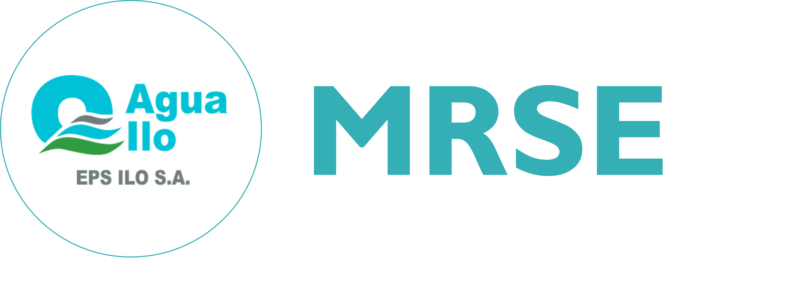
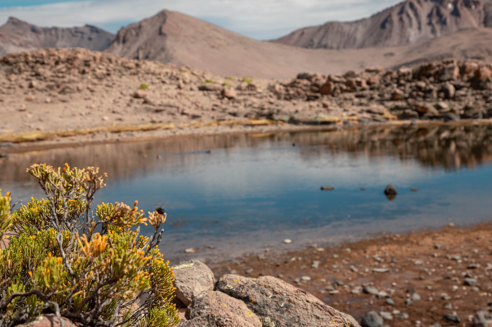
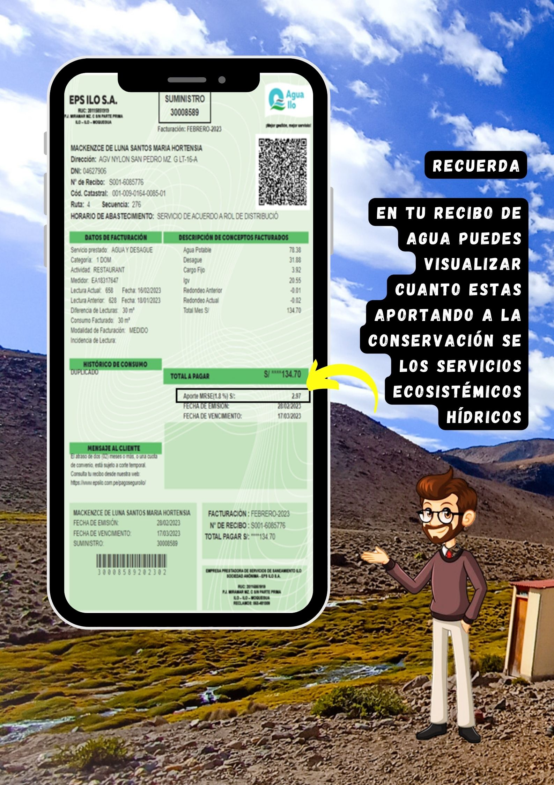
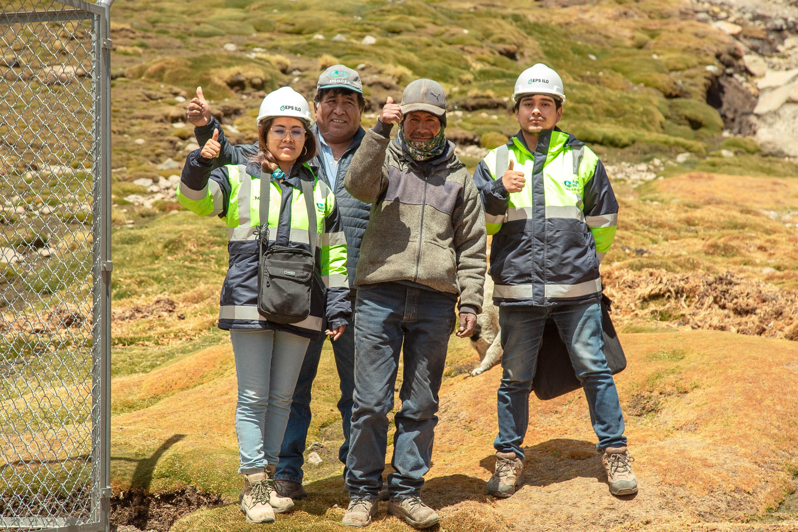
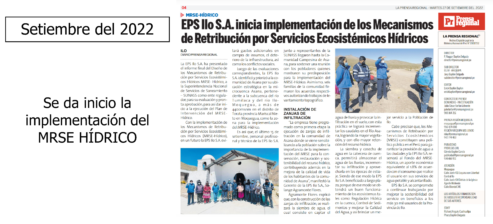
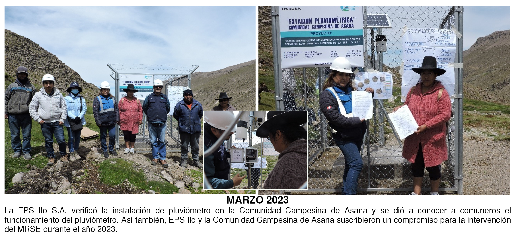
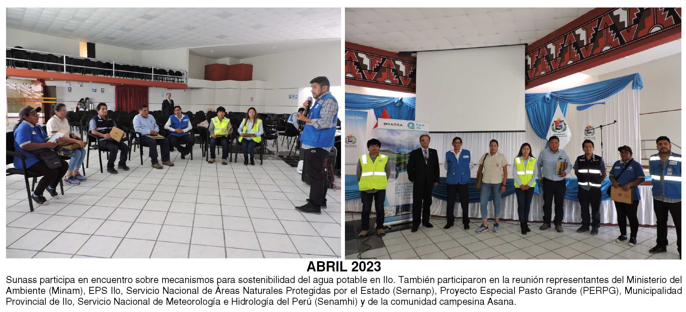
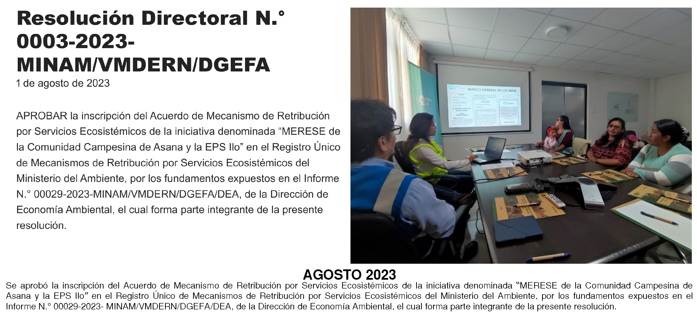

```{r setup, include=FALSE}
library(flexdashboard)
library(highcharter)
library(tidyverse)
library(xts)
#library(DT)
library(xaringanExtra)
library(plotly)
library(ggthemes)
#library(openair)
library(lubridate)
library(ragg)
library(vembedr)
```

Presentación {data-icon="fa-droplet"}
===

Column {data-width=200}
---
<center>
<!-- {width="200"} -->
{width="100%"}
</center>

### <span style="color:darkblue;font-weight:bold;">Bienvenida</span>

***MRSE-H de la EPS Ilo S.A.***

> EPS Ilo S.A. realiza implementación del Plan de Intervención los MRSE en la Comunidad Campesina de Asana con la finalidad de conservación y recuperación de los Servicios Ecosistémicos Hídricos.

***Bienvenido a esta plataforma de acceso público***

***Equipo MRSE***
<br><br>
<center>
**Correo del MRSE**<br>
Puedes comunicarte a través del correo:<br>
mrse.epsilo@gmail.com
</center>

Column {.tabset data-width="500" .tabset-fade}
---

### <span style="color:darkblue;font-weight:bold;">Ubicación de las intervenciones</span>

<div class="contenedor-imagen">
  
  
  
</div>

<!-- Agrega botones para avanzar y retroceder -->
<button id="anterior">Anterior</button>
<button id="siguiente">Siguiente</button>

<style>
        /* Estilos para el contenedor de la transición */
        .contenedor-imagen {
            width: 100%;
            height: 620px;
            position: relative;
            overflow: hidden;
        }

        /* Estilos para las imágenes */
        .contenedor-imagen img {
            width: 100%;
            height: auto;
            position: absolute;
            top: 0;
            left: 0;
            opacity: 0;
            transition: opacity 1s ease-in-out;
        }

        /* Estilo para mostrar la primera imagen */
        .contenedor-imagen img:first-child {
            opacity: 1;
        }

        /* Estilo para las imágenes anteriores */
        .image-previous {
            opacity: 0.5;
            left: -100%;
        }

        /* Estilos para los botones */
        button {
    margin: 0;
    padding: 10px 20px; /* Aumentamos el padding para un aspecto más moderno */
    font-size: 16px;
    cursor: pointer;
    position: absolute;
    top: 10px;
    background-color: rgba(0, 0, 0, 0.5); /* Fondo con transparencia */
    color: #fff; /* Color de texto blanco */
    border: none;
    border-radius: 5px; /* Bordes redondeados */
    transition: background-color 0.3s, color 0.3s; /* Efecto de transición */
    outline: none; /* Quitamos el borde al hacer clic */
}

button:hover {
    background-color: rgba(0, 0, 0, 0.8); /* Cambio de color al pasar el mouse */
}

        #anterior {
            left: 10px; /* Ajusta la posición horizontal del botón "Anterior" */
        }

        #siguiente {
            right: 10px; /* Ajusta la posición horizontal del botón "Siguiente" */
        }
    </style>

<script>
var currentImage = 0;
var images = document.querySelectorAll('.contenedor-imagen img');
var anteriorButton = document.getElementById('anterior');
var siguienteButton = document.getElementById('siguiente');

// Función para avanzar a la siguiente imagen
function avanzar() {
  images[currentImage].classList.add('image-previous');
  images[currentImage].style.opacity = 0;
  currentImage = (currentImage + 1) % images.length;
  images[currentImage].style.opacity = 1;
  images[currentImage].classList.remove('image-previous');
}

// Función para retroceder a la imagen anterior
function retroceder() {
  images[currentImage].classList.add('image-previous');
  images[currentImage].style.opacity = 0;
  currentImage = (currentImage - 1 + images.length) % images.length;
  images[currentImage].style.opacity = 1;
  images[currentImage].classList.remove('image-previous');
}

// Manejadores de clic para los botones
anteriorButton.addEventListener('click', retroceder);
siguienteButton.addEventListener('click', avanzar);

// Cambia la imagen automáticamente cada 6 segundos
setInterval(avanzar, 6000);
</script>

>Aquí te presentamos un poco de lo que se puede ver en **Asana**, ámbito de intervención del MRSE-H de la EPS Ilo.

Column {data-width=300}
---

### <span style="color:darkblue;font-weight:bold;">Presentación del MRSE-H </span>

> Si deseas visualizar la presentación en modo pantalla completa presiona **F**. También posee controles adicionales, para conocerlos presiona **H** después de haber seleccionado la presentación.

```{r}
embed_xaringan("m2/pres.html",ratio="4:3")
```
<center>

```{r}
embed_youtube("FqETSuNF4ks", height = 200, width = NULL,allowfullscreen = TRUE)
```

</center>

Mapa {data-icon="fa-map"}
===

<!-- <iframe width="1500" height="690" frameborder="0" title="Felt Map" src="https://felt.com/embed/map/MRSE-H-q4wyI3qcRr6gFqjR8mxgPC?loc=-17.05268,-70.48505,13.07z"></iframe> -->

```{r}
library(openair)
library(openairmaps)
library(dplyr)
library(leaflet)
library(sf)
library(leaflet.extras)

testigo <- read_sf("shp/cuencas.shp") %>% 
   filter(nombre == "panturane") %>% 
  as_Spatial()

interv <- read_sf("shp/cuencas.shp") %>%
   filter(nombre == "hua\u00f1uma") %>% 
  as_Spatial()

est <- read_sf("shp/estación.shp") %>%
  as_Spatial()

zanja <- read_sf("shp/zanjas.shp") %>%
  as_Spatial()
# lat = -17.062465, lon = -70.464032
polar_data$lat <- -17.062465
polar_data$lon <- -70.464032
polar_data$nox <- polar_data$ws

Colores <- c("#a6cee3", "#1f78b4",
             "#b2df8a", "#33a02c",
             "#fb9a99","#ff7f00")

infil <- unique(zanja$Comunero)
# Paleta leaflet
pal <- colorFactor(Colores, domain = infil) 

polar_data %>%
  openair::cutData("weekend") %>%
  buildPopup(
    cols = c("site", "site_type", "date", "nox"),
    names = c(
      "Site" = "site",
      "Site Type" = "site_type",
      "Date Range" = "date",
      "Average nox" = "nox"
    ),
    control = "weekend"
  ) %>%
  pollroseMap(pollutant = "nox",
              popup = "popup",
              breaks = 6,
              control = "weekend") %>%
  addProviderTiles("OpenStreetMap",
                   group = "OpenStreetMap") %>%
  addProviderTiles(providers$Esri.WorldTopoMap,
                   group = "Topográfico") %>%
  addPolygons(
    data = testigo,
    popup = "Testigo",
    fillColor = "skyblue",
    color = "white",
    label = ~nombre, group = "Cuencas") %>% 
  addPolygons(
    data = interv,
    popup = "Estudio",
    fillColor = "aquamarine",
    color = "red",
    label = ~nombre, group = "Cuencas") %>% 
  addPolylines(data = zanja, group = "Zanjas",
               col = ~pal(Comunero)) %>% 
  addAwesomeMarkers(data = est,
                    popup = "Estación pluviométrica",
                    group = "Estación") %>% 
  addDrawToolbar(targetGroup = "Borrador", 
                 editOptions = editToolbarOptions(
                   selectedPathOptions = selectedPathOptions())) %>% 
  addLayersControl(
    overlayGroups = c("Cuencas",
                      "Estación",
                      "Zanjas",
                      "Dibujo"),
    options = layersControlOptions(
      collapsed = FALSE),
    baseGroups = c(
      "OpenStreetMap",
      "Topográfico")) %>% 
  hideGroup(c("Estación","Dibujo")) %>% 
  addMeasurePathToolbar(
    options = measurePathOptions(
      imperial = FALSE,
      showDistances = TRUE)) %>% 
  addStyleEditor() %>% 
  addLegend(title = "Leyenda",
            data = zanja, group = "Zanjas",
            pal = pal,values = ~Comunero)
```


> **En este apartado se muestra un mapa web para ubicar espacialmente los elementos de nuestras intervenciones en Asana.**

Noticias {.storyboard data-icon="fa-newspaper"}
===

### EL INICIO DE LA IMPLEMENTACIÓN


### SUPERVISIÓN DE ZANJAS DE INFILTRACIÓN


### VERIFICACIÓN DE INSTALACIÓN DE PLUVIÓMETRO



### PARTICIPACIÓN EN PLATAFORMA DE BUENA GOBERNANZA



### APROBACIÓN DEL ACUERDO MERESE ANTE EL MINAM



Precipitación {data-icon="fa-chart-simple"}
===

## Column {data-width="600"}

### <span style="color:darkblue;font-weight:bold;">GRÁFICO DE CALENDARIO</span>

```{r}
# Carga de las bases de datos:
df0 <- read.csv("mayo.csv")[1:6584,-1]
df <- read.csv("Estacion_julio_0.csv",
               sep = ",")
names(df) <- c("fecha","Precipitacion")
df <- df %>% 
  mutate(fecha= as.POSIXct(
    fecha,format="%m/%d/%Y %H:%M"))
df0 <- df0 %>% 
  mutate(fecha= as.POSIXct(
    paste(fecha,hora,sep=" "),
    format="%Y-%m-%d %H:%M")) %>% 
  select(fecha,Precipitacion)

# Data completa:
df <- rbind(df0,df)

# Datos diarios:

df3 <- df[,c(1,2)] %>% mutate(
  fecha = as.Date(fecha, format="%Y-%m-%d"),
  fecha1 = format(fecha, format = "%Y-%m"),
  fecha2 = format(fecha, format = "%m"),
  fecha3 = format(fecha, format= "%d")) %>% 
  group_by(fecha,fecha1,fecha2,fecha3) %>% 
  summarise(Precipitacion= sum(Precipitacion,na.rm=F)) %>% 
  ungroup()

# Gráfico de barras para facetas:
m2 <- df3 %>% ggplot(aes(x=fecha3,y=Precipitacion))+
  geom_bar(stat="identity",fill="turquoise")+
  labs(x="Fecha",y="Precipitación (mm)") + 
  theme_minimal() + theme(plot.title = element_text(size = 14,
    face = "bold", hjust = 0.5),
    plot.subtitle = element_text(size = 12,
    face = "italic", hjust = 0.5),
    legend.position = "none",
    strip.text.x = element_text(colour = "white",face = "bold",
                                family = "helvetica"),
    strip.background = element_rect(
     color="#3182BD", fill="#3182BD",
     size=1.5, linetype="solid"),
    axis.title = element_text(size = 7),
    axis.text.x = element_text(size = 7,
        angle = 90)) +
  facet_wrap(~fecha1,ncol=1)

# gráfico ggplot para cajas:
a1 <- df3 %>% ggplot(aes(x=fecha2,y=Precipitacion))+
  geom_boxplot(color="darkblue",fill="transparent",outlier.shape = NA)+
  labs(x = "Meses",color="Meses",fill="Meses",y="Precipitación (mm)")+
  geom_jitter(size=1.8,alpha=0.4,color="#3182BD",width = 0.15) +
  theme(legend.position = "none")+
  theme_minimal()


####### Calendario

dat_pr <- df3[,c(1,5)]
  names(dat_pr) <- c("date","pr")
  
  dat_pr <- dat_pr %>% 
    complete(date = seq(ymd("2023-02-01"), 
                        ymd("2023-07-31"),"day")) %>%
    mutate(weekday = wday(date, label = T, week_start = 1,
                          locale = Sys.getlocale("LC_TIME")), 
           month = month(date, label = T, abbr = F),
           week = isoweek(date),
           day = day(date))


  dat_pr <- mutate(dat_pr, 
                   week = case_when(month == "December" & week == 1 ~ 53,
                                    month == "January" & week %in% 52:53 ~ 0,
                                    TRUE ~ week))

  
# color ramp
pubu <- RColorBrewer::brewer.pal(9, "PuBu")
col_p <- colorRampPalette(pubu)  
  
# Configuración del tema
theme_calendar <- function(){
    theme(aspect.ratio = 1/2,
          axis.title = element_blank(),
          axis.ticks = element_blank(),
          axis.text.y = element_blank(),
          axis.text = element_text(
            family = "Montserrat"),
          panel.grid = element_blank(),
          panel.background = element_blank(),
          strip.background = element_blank(),
          strip.text = element_text(
            family = "Montserrat", face = "bold", size = 15),
          legend.position = "top",
          legend.text = element_text(
            family = "Montserrat", hjust = .5),
          legend.title = element_text(
            family = "Montserrat", size = 9, hjust = 1),
          plot.caption =  element_text(
            family = "Montserrat", hjust = 1, size = 8),
          panel.border = element_rect(
            colour = "grey", fill=NA, size=1),
          plot.title = element_text(
            family = "Montserrat", hjust = .5, size = 22,
            face = "bold",margin = margin(
              0,0,0.5,0, unit = "cm")),
          plot.subtitle = element_text(
            family = "Montserrat", hjust = .5, size = 16)
    )
  }
  
# Cambiando las etiquetas de los dias de la semana:
dat_pr$weekday <- factor(
  dat_pr$weekday,
  labels = c("lun\\."="l",
             "mar\\."= "m",
             "mié\\."="mi","jue\\." ="j",
             "vie\\."="v","sáb\\."="s",
             "dom\\."="d"))

n <-   ggplot(dat_pr, 
         aes(weekday, -week, fill = pr)) +
    geom_tile(colour = "transparent",
              size = .4)  + 
    geom_text(aes(label = day),
              size = 1.4, color = "black") +
  scale_fill_gradient(low = "white",
                      high = "#3182BD",na.value = "white")+
  facet_wrap(~ month, nrow = 4,
             ncol = 3, scales = "free") +
  labs(title = "¿Cuánto ha llovido?",
       subtitle = "Precipitación Mensual",
       fill = "Precipitación (mm)") +
  theme_calendar()

ggplotly(n) 
```

### <span style="color:darkblue;font-weight:bold;">DATOS CRUDOS (DESCARGA)</span>

```{r}
data <- df[,c(1,2)]
data$fecha <- as.numeric(data$fecha)*1000-(5*3600*1000)

highchart(type = "stock") %>%
  hc_title(text = "Estación Asana (Datos crudos)") %>%
  hc_xAxis(type = "datetime") %>%
  hc_add_series(data = data, type = "column",
                hcaes(x = fecha, y = Precipitacion),
                name = "Precipitacion", color = "#3182BD") %>%
  hc_exporting(
    enabled = TRUE,
    buttons = list(
      contextButton = list(
        menuItems = c("downloadPNG",
                      "downloadPDF",
                      "separator",
                      "downloadCSV",
                      "downloadXLS",
                      "separator",
                      "resetZoom")
      )
    )
  ) %>% 
  hc_xAxis(type = "datetime", showLastLabel = TRUE,
           dateTimeLabelFormats = list(month = "%B")) %>% 
  hc_tooltip(shared = TRUE, useHTML = TRUE) %>% 
  hc_chart(zoomType = "x")
```


## Column {data-width="350"}

### <span style="color:darkblue;font-weight:bold;">GRÁFICO DE BARRAS</span>

```{r}
ggplotly(p=m2)
```

## Column {data-width="350"}

### Precipitación acumulada total

```{r}
valueBox(paste0(sum(df$Precipitacion, na.rm=T)," milímetros"), icon = "fa-droplet")

```

### Inicio de mediciones

```{r}
valueBox(min(df$fecha), icon = "fa-pencil")
```

### Última dato descargado de la estación

```{r}
valueBox(max(df$fecha), icon = "fa-pencil")
```

### <span style="color:darkblue;font-weight:bold;">GRÁFICO DE CAJAS</span>

```{r}
ggplotly(a1)
```