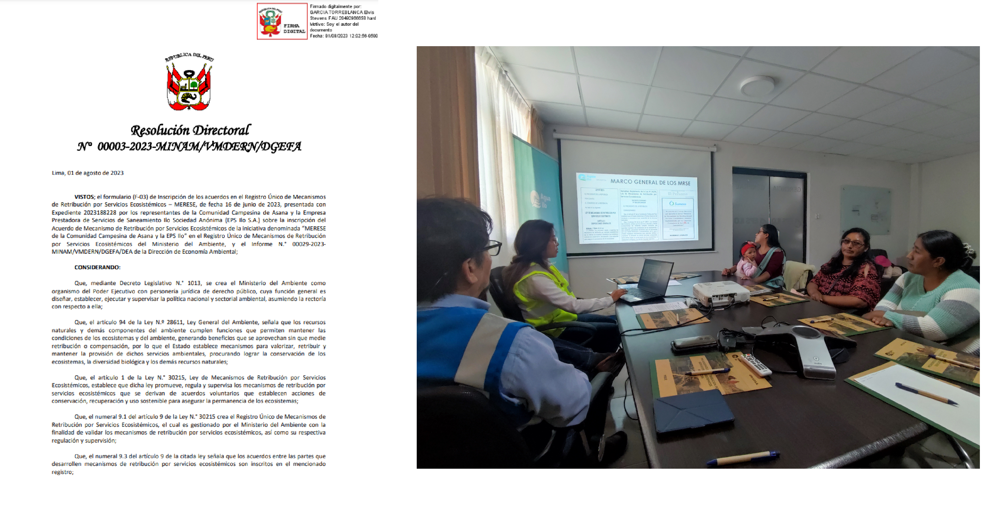

```{r setup, include=FALSE}
library(flexdashboard)
library(highcharter)
library(tidyverse)
library(xts)
library(DT)
library(xaringanExtra)
library(plotly)
library(ggthemes)
library(openair)
library(lubridate)
library(ragg)
```

Presentación {data-icon="fa-droplet"}
===

Column {data-width=200}
---
<center>
{width="200"}
</center>

### <span style="color:darkblue;font-weight:bold;">Bienvenida</span>

> ***MRSE Hídricos de la EPS Ilo S.A.***
>
>
>
>EPS Ilo S.A. realiza implementación del Plan de Intervención los MRSE en la Comunidad Campesina de Asana con la finalidad de conservación y recuperación de los Servicios Ecosistemos Hídricos.
>
>
>
>
> ***Bienvenido a esta plataforma de acceso público***

> --- ***Equipo MRSE***

Column {.tabset data-width="600" .tabset-fade}
---
<center>
<b>Hola</b><br>
Aquí te presentamos una breve infografía esperando sea de tu agrado y ayude para una mejor comprensión de lo que puede hacer un MRSE.
</center>

### <span style="color:darkblue;font-weight:bold;">Hoja 1</span>


### <span style="color:darkblue;font-weight:bold;">Hoja 2</span>


Column {data-width=350}
---

### <span style="color:darkblue;font-weight:bold;">Presentación del MRSE-H </span>

```{r}
embed_xaringan("m2/pres.html",ratio="4:3")
```

### <span style="color:darkblue;font-weight:bold;">Ubicación de las intervenciones</span>

<iframe width="100%" height="450" frameborder="0" title="Felt Map" src="https://felt.com/embed/map/MRSE-HIDRICO-EPS-ILO-S-A-q4wyI3qcRr6gFqjR8mxgPC?loc=-17.04828,-70.48587,13.67z"></iframe>


Noticias {.storyboard data-icon="fa-newspaper"}
===

### EL INICIO DE LA IMPLEMENTACIÓN


### SUPERVISIÓN DE ZANJAS DE INFILTRACIÓN


### VERIFICACIÓN DE INSTALACIÓN DE PLUVIÓMETRO


### PARTICIPACIÓN EN PLATAFORMA DE BUENA GOBERNANZA


### APROBACIÓN DEL ACUERDO MERESE ANTE EL MINAM



Precipitación {data-icon="fa-chart-simple"}
===

## Column {data-width="600"}

### <span style="color:darkblue;font-weight:bold;">GRÁFICO DE CALENDARIO</span>

```{r}
# Carga de las bases de datos:
df0 <- read.csv("mayo.csv")[1:6584,-1]
df <- read.csv("Estacion_julio_0.csv",
               sep = ",")
names(df) <- c("fecha","Precipitacion")
df <- df %>% 
  mutate(fecha= as.POSIXct(
    fecha,format="%m/%d/%Y %H:%M"))
df0 <- df0 %>% 
  mutate(fecha= as.POSIXct(
    paste(fecha,hora,sep=" "),
    format="%Y-%m-%d %H:%M")) %>% 
  select(fecha,Precipitacion)

# Data completa:
df <- rbind(df0,df)

# Datos diarios:

df3 <- df[,c(1,2)] %>% mutate(
  fecha = as.Date(fecha, format="%Y-%m-%d"),
  fecha1 = format(fecha, format = "%Y-%m"),
  fecha2 = format(fecha, format = "%m"),
  fecha3 = format(fecha, format= "%d")) %>% 
  group_by(fecha,fecha1,fecha2,fecha3) %>% 
  summarise(Precipitacion= sum(Precipitacion,na.rm=T)) %>% 
  ungroup()

# Gráfico de barras para facetas:
m2 <- df3 %>% ggplot(aes(x=fecha3,y=Precipitacion))+
  geom_bar(stat="identity",fill="turquoise")+
  labs(x="Fecha",y="Precipitación (mm)") + 
  theme_minimal() + theme(plot.title = element_text(size = 14,
    face = "bold", hjust = 0.5),
    plot.subtitle = element_text(size = 12,
    face = "italic", hjust = 0.5),
    legend.position = "none",
    strip.text.x = element_text(colour = "white",face = "bold",
                                family = "helvetica"),
    strip.background = element_rect(
     color="#3182BD", fill="#3182BD",
     size=1.5, linetype="solid"),
    axis.title = element_text(size = 7),
    axis.text.x = element_text(size = 7,
        angle = 90)) +
  facet_wrap(~fecha1,ncol=1)

# gráfico ggplot para cajas:
a1 <- df3 %>% ggplot(aes(x=fecha2,y=Precipitacion))+
  geom_boxplot(color="darkblue",fill="transparent",outlier.shape = NA)+
  labs(x = "Meses",color="Meses",fill="Meses",y="Precipitación (mm)")+
  geom_jitter(size=1.8,alpha=0.4,color="#3182BD",width = 0.15) +
  theme(legend.position = "none")+
  theme_minimal()


####### Calendario

dat_pr <- df3[,c(1,5)]
  names(dat_pr) <- c("date","pr")
  
  dat_pr <- dat_pr %>% 
    complete(date = seq(ymd("2023-02-01"), 
                        ymd("2023-07-31"),"day")) %>%
    mutate(weekday = wday(date, label = T, week_start = 1,
                          locale = Sys.getlocale("LC_TIME")), 
           month = month(date, label = T, abbr = F),
           week = isoweek(date),
           day = day(date))


  dat_pr <- mutate(dat_pr, 
                   week = case_when(month == "December" & week == 1 ~ 53,
                                    month == "January" & week %in% 52:53 ~ 0,
                                    TRUE ~ week))

  
# color ramp
pubu <- RColorBrewer::brewer.pal(9, "PuBu")
col_p <- colorRampPalette(pubu)  
  
# Configuración del tema
theme_calendar <- function(){
    theme(aspect.ratio = 1/2,
          axis.title = element_blank(),
          axis.ticks = element_blank(),
          axis.text.y = element_blank(),
          axis.text = element_text(
            family = "Montserrat"),
          panel.grid = element_blank(),
          panel.background = element_blank(),
          strip.background = element_blank(),
          strip.text = element_text(
            family = "Montserrat", face = "bold", size = 15),
          legend.position = "top",
          legend.text = element_text(
            family = "Montserrat", hjust = .5),
          legend.title = element_text(
            family = "Montserrat", size = 9, hjust = 1),
          plot.caption =  element_text(
            family = "Montserrat", hjust = 1, size = 8),
          panel.border = element_rect(
            colour = "grey", fill=NA, size=1),
          plot.title = element_text(
            family = "Montserrat", hjust = .5, size = 22,
            face = "bold",margin = margin(
              0,0,0.5,0, unit = "cm")),
          plot.subtitle = element_text(
            family = "Montserrat", hjust = .5, size = 16)
    )
  }
  
# Cambiando las etiquetas de los dias de la semana:
dat_pr$weekday <- factor(
  dat_pr$weekday,
  labels = c("lun\\."="l",
             "mar\\."= "m",
             "mié\\."="mi","jue\\." ="j",
             "vie\\."="v","sáb\\."="s",
             "dom\\."="d"))

n <-   ggplot(dat_pr, 
         aes(weekday, -week, fill = pr)) +
    geom_tile(colour = "transparent",
              size = .4)  + 
    geom_text(aes(label = day),
              size = 1.4, color = "black") +
  scale_fill_gradient(low = "white",
                      high = "#3182BD",na.value = "white")+
  facet_wrap(~ month, nrow = 4,
             ncol = 3, scales = "free") +
  labs(title = "¿Cuánto ha llovido en Asana?",
       subtitle = "Precipitación Mensual",
       fill = "Precipitación (mm)") +
  theme_calendar()

ggplotly(n) 
```

### <span style="color:darkblue;font-weight:bold;">DATOS CRUDOS (DESCARGA)</span>

```{r}
data <- df[,c(1,2)]
data$fecha <- as.numeric(data$fecha)*1000-(5*3600*1000)

highchart() %>%
  hc_title(text = "Estación Asana (Datos crudos)") %>%
  hc_xAxis(type = "datetime") %>%
  hc_add_series(data = data, type = "column",
                hcaes(x=fecha,y=Precipitacion),
                name="Precipitacion",color="#3182BD") %>%
  hc_exporting(
    enabled = TRUE,
    buttons = list(
      contextButton = list(
        menuItems = c("downloadPNG",
                      "downloadCSV",
                      "downloadPDF",
                      "downloadJPEG",
                      "downloadXLS",
                      "separator",
                      "resetZoom")))) %>% 
  hc_xAxis(type = "datetime", showLastLabel = FALSE,
           dateTimeLabelFormats = list(month = "%B")) %>% 
  hc_tooltip(shared = TRUE, useHTML = TRUE) %>% 
  hc_chart(zoomType = "x")
```


## Column {data-width="350"}

### <span style="color:darkblue;font-weight:bold;">GRÁFICO DE BARRAS</span>

```{r}
ggplotly(p=m2)
```

## Column {data-width="350"}

### Precipitación acumulada total

```{r}
valueBox(paste0(sum(df$Precipitacion, na.rm=T)," milímetros"), icon = "fa-droplet")

```

### Inicio de mediciones

```{r}
valueBox(min(df$fecha), icon = "fa-pencil")
```

### Última dato descargado de la estación

```{r}
valueBox(max(df$fecha), icon = "fa-pencil")
```

### <span style="color:darkblue;font-weight:bold;">GRÁFICO DE CAJAS</span>

```{r}
ggplotly(a1)
```

